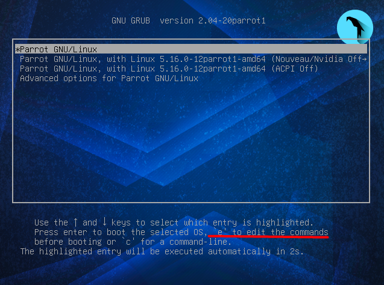
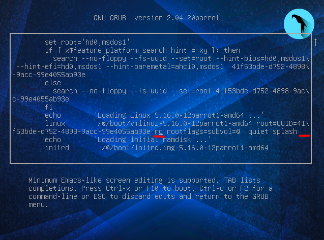
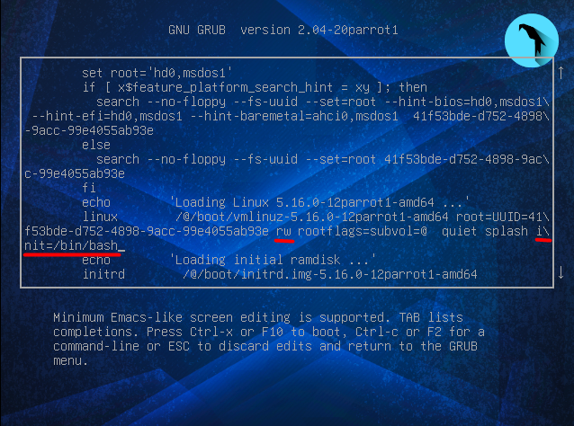

# Recuperar usuario en ParrotOS

Voy a realizar una pequeña prueba, para, en un entorno ParrotOS corriendo bajo una máquina virtual, acceder a una terminal como el usuario root, es decir, con privilegios.

Destacar que esto no es un bug ni nada por el estilo, simplemente es una caracteristica para el mantenimiento del sistema, puede ser usado para recuperar archivos dañados que no nos permitan arrancar el sistem, podemos cambiar la contraseña de los usuarios etc.

## Requisitos

Que el disco duro de la máquina a la cual queremos acceder no esté cifrado.

## Descripción

Para realizar esto, tendremos que modificar el GRUB antes del arranque del sistema operativo, es tan sencillo como darle a la tecla '**e**' en nuestro teclado cuando estamos en la siguiente pantalla.

Una vez hemos pulsado el atajo se nos abrirá una vista para editar los parámetros del kernel.

  

Como vemos en la anterior imagen, he subrayado en rojo dos cosas sobre el parámetro lnix
* 'ro' que hace referencia a los permisos readonly. Lo cambiaremos por 'rw' read-write.
* un espacio en blanco, en el cual tendremos que poner lo siguiente: init=/bin/bash

Lo que estamos haciendo en los pasos anteriores es indicarle al kernel que monte el sistema de fichero root con permisos de lectura y escritura, con lo cual, podremos configurar correctamente ficheros desconfigurados, o cambiar la contraseña de algún usuario.

En la siguiente imagen vemos como quedaría el parámetro.

Pulsamos F10, arrancamos y como vemos en la última imagen, nos ha abierto una terminal ejecutada bajo el usuario root.

Como vemos, hemos podido cambiar la contraseña del usuario juan.

# Articulos relacionados

[Kernel y sus parámetros](https://wiki.archlinux.org/title/kernel_parameters)

[Discusión sobre la carácteristica](https://unix.stackexchange.com/questions/34462/why-does-linux-allow-init-bin-bash)
